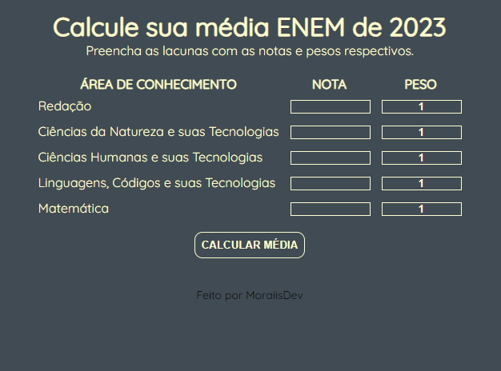

<h1 align="center"> Calculadora de média do Enem! </h1>

Projeto pessoal criado para pessoas que prestaram o ENEM 2023, assim como eu, e precisarão de um auxílio para fazerem o cálculo de suas médias
com base em suas notas e pesos respectivos.

    

# Como funciona?
* Insira as médias de cada disciplina avaliada no ENEM, disponibilizadas no site do INEP. (5 disciplinas)
* Em casos de Universidades que há pesos por cada disciplina, o campo também deve ser preenchido respectivamente como consta na Universidade.
* Clique no botão "Calcular média" e confira sua nota, que será utilizada para ingresso no SISU e PROUNI.
* OBS: O peso deve ser menor do que 5 (peso máximo) , caso contrário, o sistema não dará o resultado e retornará uma mensagem de erro.

Espero que goste! Boa Sorte! 🎉
